## Easy Pick
An initiavitive to reduce paper consumption and making picking products a fun task :)

## Features
  * Follows [Material Design Guidelines]
  * Uses multiple themes(Light, Dark & Night)
  * Has support to 16 languages from in app using MachineLearning(English - ForeginLanguage)
  * Provides graphical view of the papers saved

## Screens
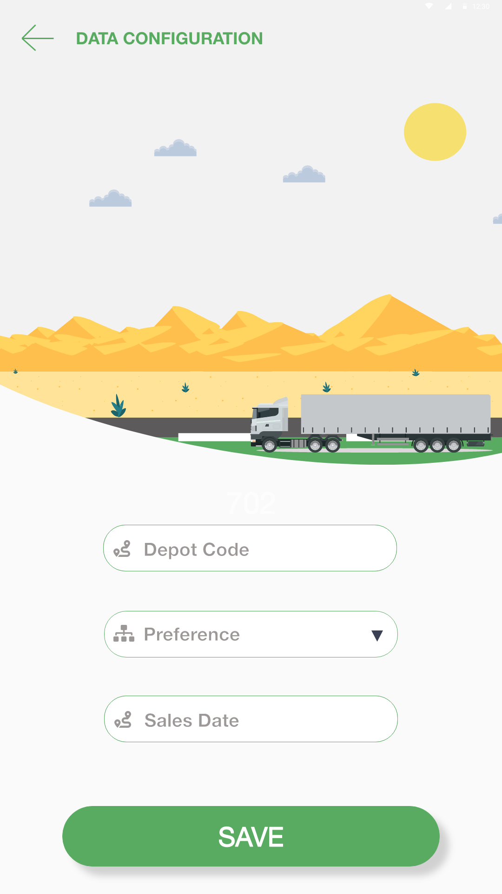	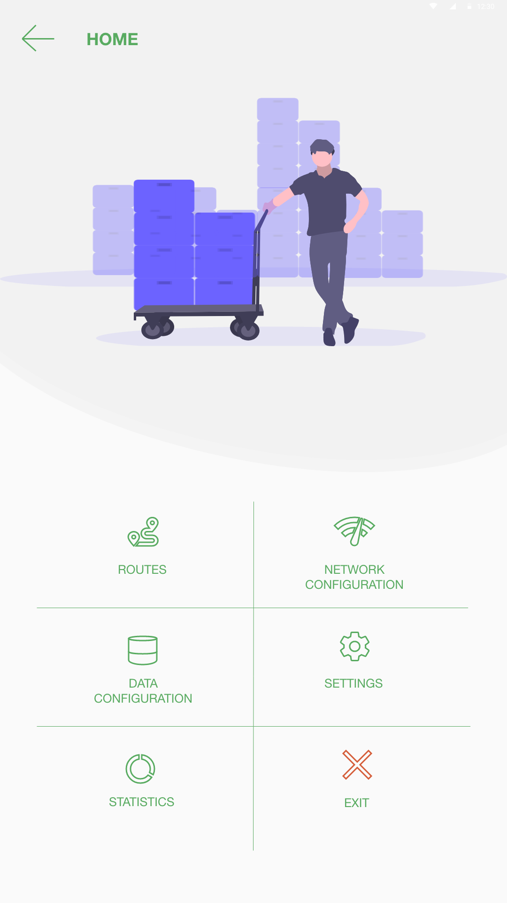
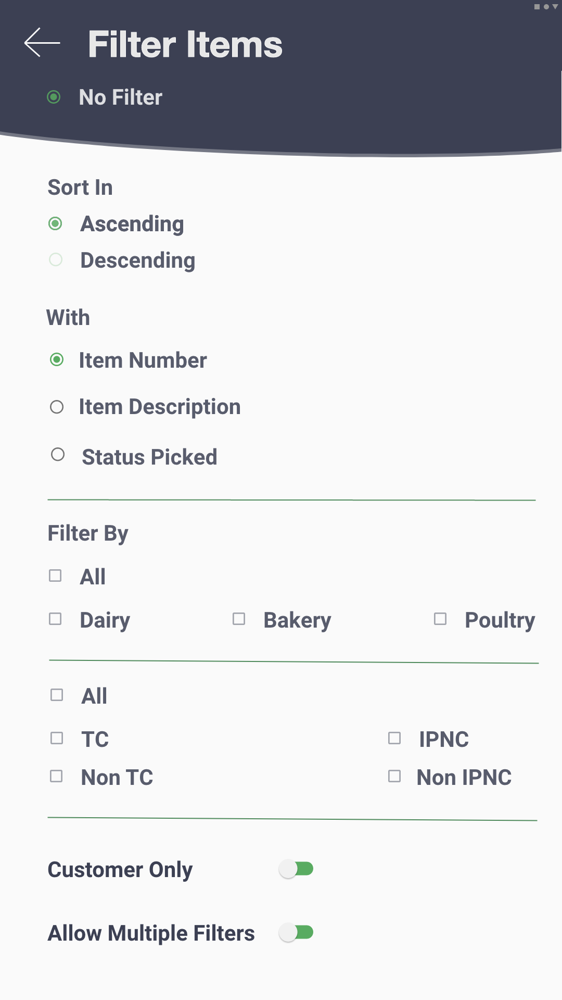	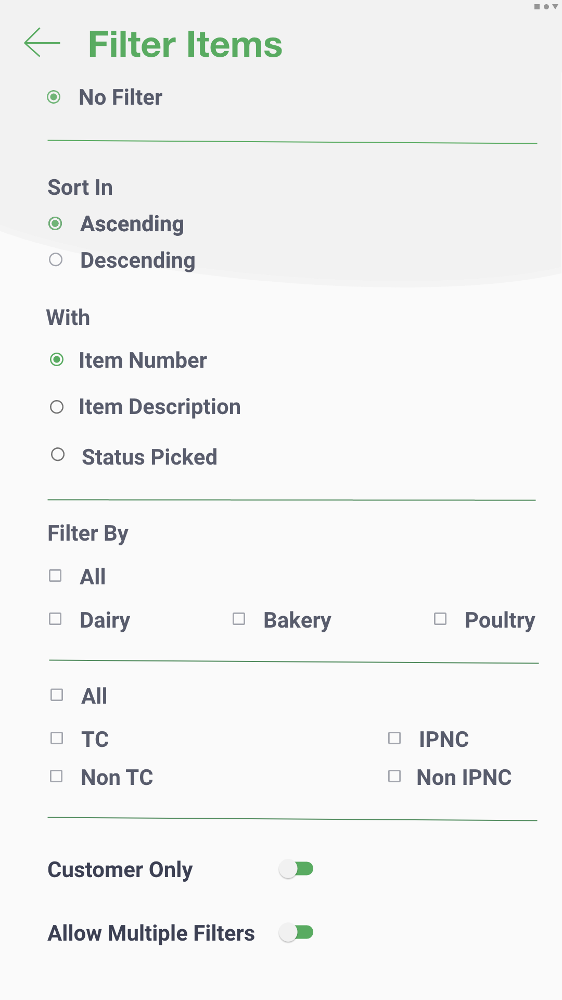
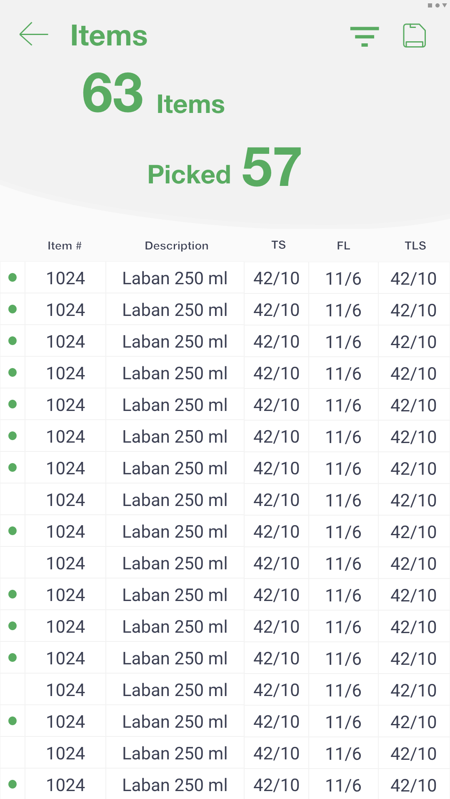	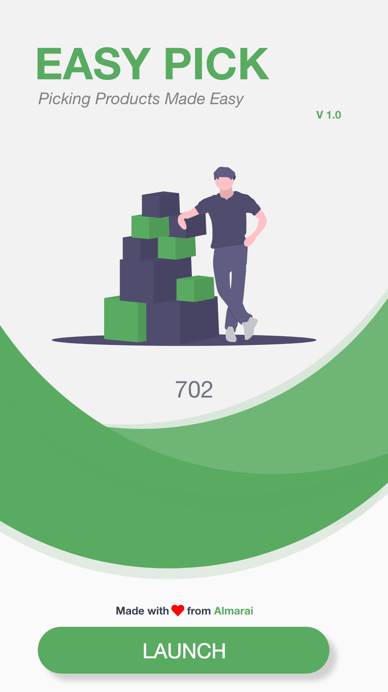

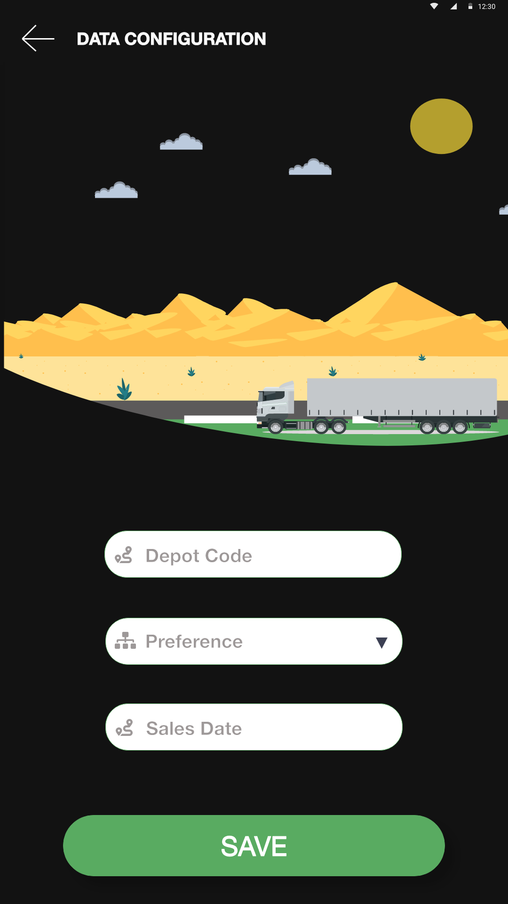	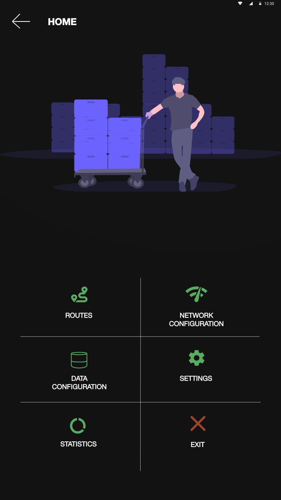
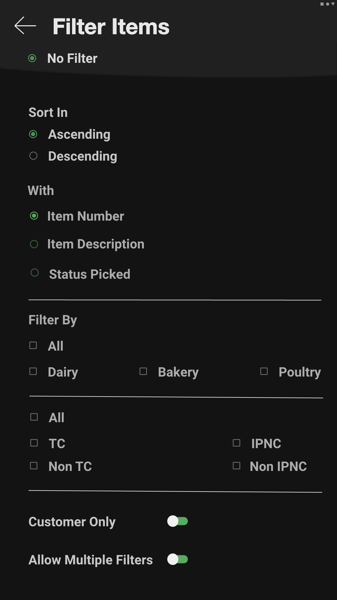	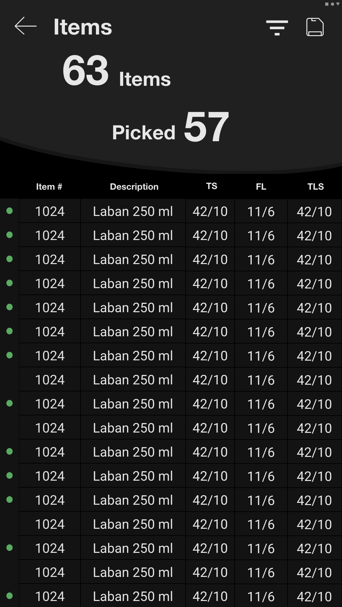
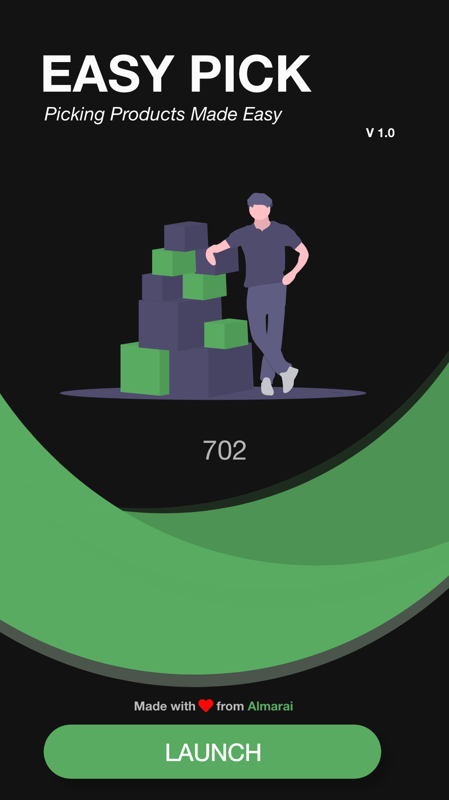	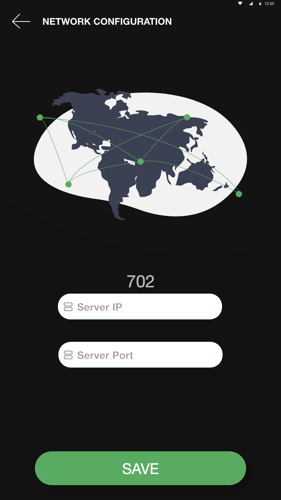
  
## Libraries
  * Uses Firebase Analytics, crashlytics, firestore & storage
  * Jetpack Navigation
  * Retrofit
  * Hilt
  * Lottie Files for beautiful Animations
  
## Languages
  * Koltin with Kotlin-DSL for gradle scripts

## Architecture
  * MVVM
  
## Setting Up
You will need to add your API key to the project, generate it from the [google console]

## Report Issues
Notice any issues with a repository? Please file a github issue in the repository.

License
=======

    Licensed under the Apache License, Version 2.0 (the "License");
    you may not use this file except in compliance with the License.
    You may obtain a copy of the License at

       http://www.apache.org/licenses/LICENSE-2.0

    Unless required by applicable law or agreed to in writing, software
    distributed under the License is distributed on an "AS IS" BASIS,
    WITHOUT WARRANTIES OR CONDITIONS OF ANY KIND, either express or implied.
    See the License for the specific language governing permissions and
    limitations under the License.

[google console]: https://console.developers.google.com/
[Material Design Guidelines]: https://material.io/

